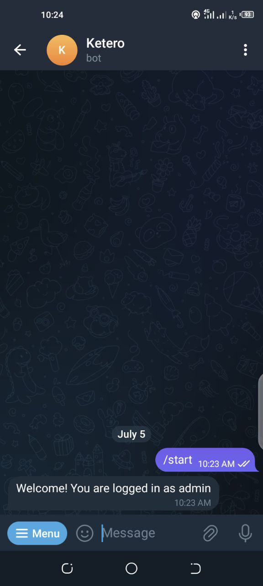
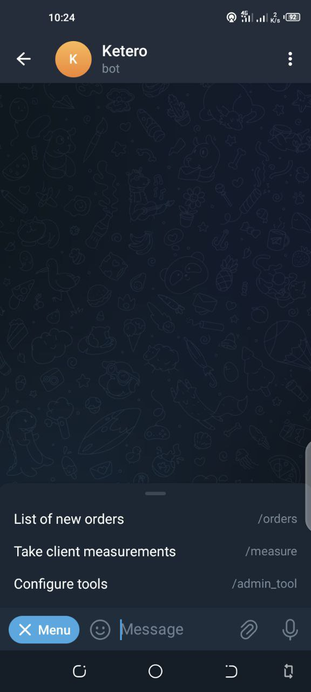
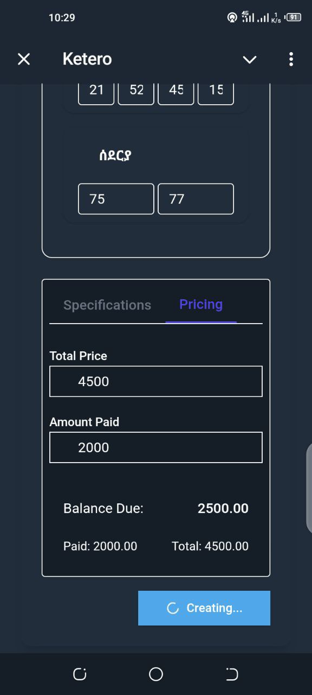
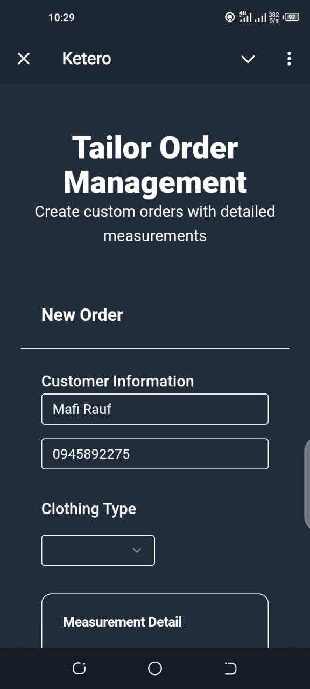
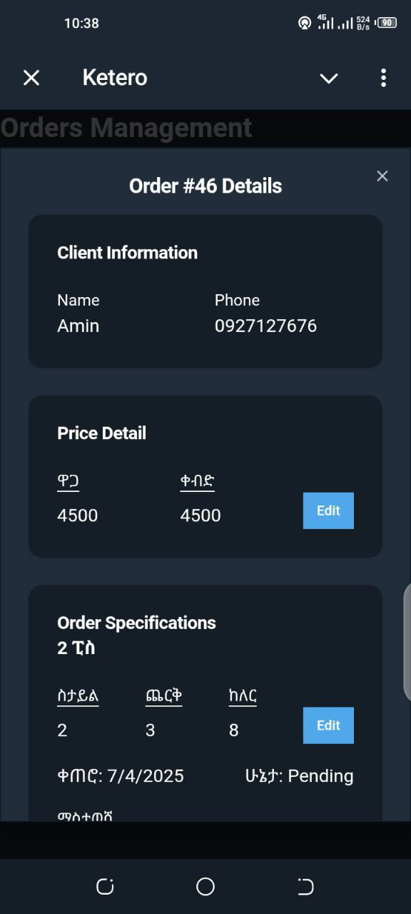
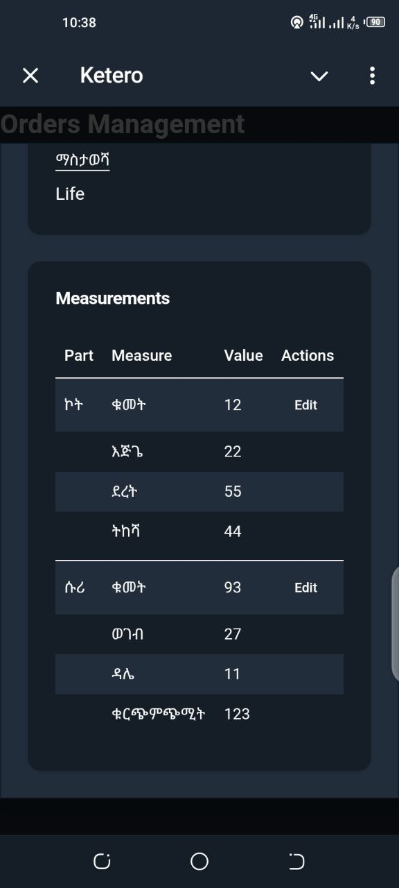

# Ketero Platform

A full-stack custom order management system built for tailoring businesses.  
It combines a web-based dashboard and a Telegram bot to streamline client interactions, order tracking, and measurement handling.

---

## 📌 Overview

Ketero is composed of three parts:

- **Frontend** (Next.js) – A responsive admin dashboard to manage clients, orders, and measurements.
- **Backend** (Go) – A secure REST API for storing and retrieving data.
- **Telegram Bot** (Telegraf.js) – For handling client-side interactions in chat.

Each part lives in a separate repository and is included here as a submodule.

---

---

## 🛠 Tech Stack

- **Frontend**: Next.js, Tailwind CSS
- **Backend**: Go, PostgreSQL
- **Bot**: Telegraf.js
- **Other**: GitHub Submodules

---

## 📷 Screenshots

> Replace the below with actual image links or markdown images

### 1. Home (bot entry)





### 2. Order Form





## 🚀 Setup Instructions

### 1. Clone the hub repo

```bash
git clone --recurse-submodules git@github.com:Mafilala/ketero.git
cd ketero

```
